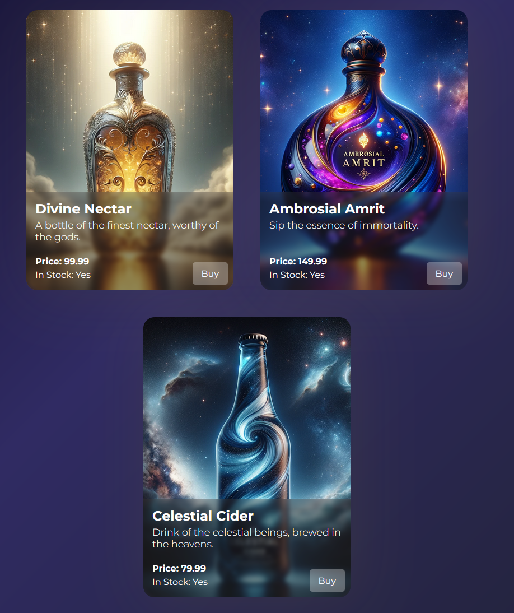

# NectarNook **(_Work in Progress)_**

Welcome to NectarNook, your premier destination for exploring the world through flavor. At NectarNook, we believe that every drop of nectar has the power to transcend the ordinary, offering a taste of the divine and a journey beyond the everyday.

## Vision

"Transcend the ordinary and savor the essence of life with NectarNook, where every drop is a journey beyond the everyday."

Our mission is to bring the most exquisite collection of nectars from every corner of the globe directly to you, allowing for an unparalleled exploration of flavors and experiences.

## Features

- **Explore Global Flavors**: Discover nectars from diverse cultures and regions, each with its unique story and flavor profile.
- **Curated Selections**: Our expertly curated selections ensure only the highest quality nectars make it to your doorstep.
- **Sustainable Sourcing**: We're committed to sustainability, ensuring that our products are sourced responsibly and ethically.

## Technologies Used

NectarNook is built using cutting-edge technologies to ensure a seamless and immersive experience for our users:

- **Frontend**:

  - **React**: A JavaScript library for building user interfaces, enabling dynamic and responsive pages.
  - **Vite**: An incredibly fast frontend build tool, providing a smoother and faster development experience with features like hot module replacement.

- **Backend**:
  - **FastAPI**: A modern, fast (high-performance) web framework for building APIs with Python 3.7+ that's based on standard Python type hints.
  - **SQLAlchemy**: The Python SQL toolkit and Object-Relational Mapping (ORM) library that gives application developers the full power and flexibility of SQL.
  - **SQLite**: Chosen for its simplicity and ease of use for smaller-scale applications, serving as the database backend.
  - **Alembic**: For database migrations, ensuring the database schema stays in sync with the application models.
- **Security**:

  - **OAuth2 (work in progres)**: For secure authentication of users, particularly for access to the admin panel to manage product information.
  - **bcrypt**: For hashing user passwords before storing them in the database, ensuring that user credentials are kept secure.

- **Deployment**: Aim to use Docker and Kubernetes, for seamless deployment and scaling.

## Getting Started

To start your journey with NectarNook, follow these steps:

1. **Visit Our Website**: Head over to [NectarNook](#) to browse our collection.
2. **Create an Account**: Sign up to personalize your experience and keep track of your favorite nectars.
3. **Explore and Purchase**: Dive into our selections and purchase the nectars that call out to you.

## Contribution

We're always on the lookout for enthusiasts who share our passion for flavor exploration. If you're interested in contributing to NectarNook, whether through sourcing, reviews, or community engagement, please reach out to us at [contact@nectarnook.com](mailto:#).

## Support

For support or to report any issues, please email us at [support@nectarnook.com](mailto:#).

## Follow Us

Stay updated with the latest from NectarNook:

- [Instagram](#)
- [Facebook](#)
- [Twitter](#)

## Note

Please note that NectarNook is a **fictional** project created for illustrative and educational purposes. The brand, website, and products mentioned in this README do not exist in reality.

Thank you for choosing NectarNook for your flavor exploration journey. We're excited to have you with us as we transcend the ordinary, one drop at a time.
